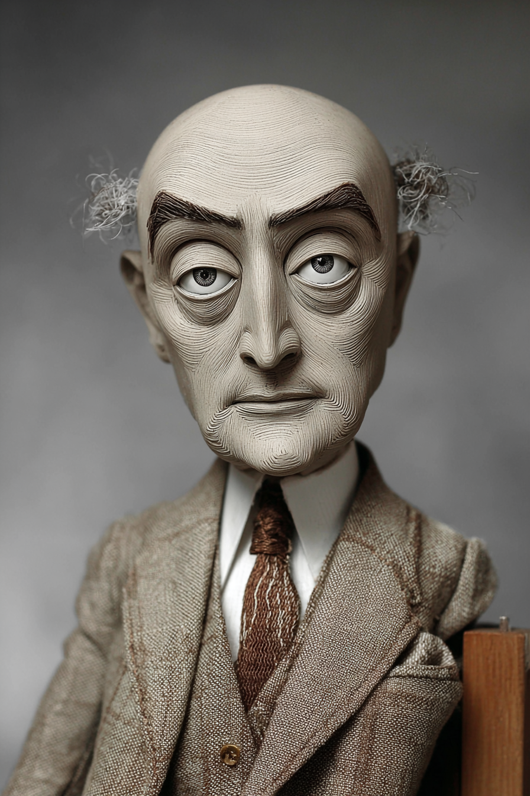

# Principles of Management — Wayback Sections

> Extracted from `chapters/`. Each entry corresponds to one chapter file.
> Sections are instructor-authored. Missing sections show a placeholder only.
> Do not edit this file directly — edit the source chapter file, then re-run extraction.

---

## Chapter 00: Principles of Management: with LLMs
*Source: `chapters/00-frontmatter.md`*

> **Section not yet authored.** No `## AI Wayback Machine` block found in this chapter file.
> To add this section, edit the source chapter file directly.

---

## Chapter 00: Introduction
*Source: `chapters/00-introduction.md`*

> **Section not yet authored.** No `## AI Wayback Machine` block found in this chapter file.
> To add this section, edit the source chapter file directly.

---

## Chapter 01: Chapter 1 — Management and Organizational Behavior
*Source: `chapters/01-management-and-organizational-behavior.md`*

## AI Wayback Machine

**Mary Parker Follett** was an organizational theorist who argued that conflict should be resolved by "integration" — not domination or compromise. Peter Drucker called her the "prophet of management."

**Run this:**

```
Who is Mary Parker Follett, and how does their work connect to management
and OB we covered in this chapter? Keep it to three paragraphs. End with
the single most surprising thing about their career or ideas.
```

→ Search **"Mary Parker Follett"** on Wikipedia.

**Now make the prompt better.** Try one of these:

- Ask it to apply Mary Parker Follett's framework to a current management question.
- Add a constraint: "Answer including criticisms or limits of Mary Parker Follett's framework."

What changes? What gets better? What gets worse?

---

## Chapter 02: Chapter 2 — Individual and Cultural Differences
*Source: `chapters/02-individual-and-cultural-differences.md`*

## AI Wayback Machine

**Geert Hofstede** developed the cultural-dimensions framework from his 1970s IBM study across 50 countries.

**Run this:**

```
Who is Geert Hofstede, and how does their work connect to cultural differences we covered in this chapter? Keep it to three paragraphs. End with the single most surprising thing about their career or ideas.
```

→ Search **"Geert Hofstede"** on Wikipedia.

**Now make the prompt better.** Try one of these:

- Ask it to apply Geert Hofstede's framework to a current management question.
- Add a constraint: "Answer including criticisms or limits of Geert Hofstede's framework."

What changes? What gets better? What gets worse?

---

## Chapter 03: Chapter 3 — Perception and Job Attitudes
*Source: `chapters/03-perception-and-job-attitudes.md`*

## AI Wayback Machine

**Frederick Herzberg** developed the two-factor theory of job satisfaction in 1959 — distinguishing motivators from hygiene factors.

**Run this:**

```
Who is Frederick Herzberg, and how does their work connect to job
attitudes we covered in this chapter? Keep it to three paragraphs.
End with the single most surprising thing about their career or ideas.
```

→ Search **"Frederick Herzberg"** on Wikipedia.

**Now make the prompt better.** Try one of these:

- Ask it to apply Frederick Herzberg's framework to a current management question.
- Add a constraint: "Answer including criticisms or limits of Frederick Herzberg's framework."

What changes? What gets better? What gets worse?

---

## Chapter 04: Chapter 4 — Learning and Reinforcement
*Source: `chapters/04-learning-and-reinforcement.md`*

## AI Wayback Machine

**B.F. Skinner** was a behaviorist whose operant conditioning framework shaped modern organizational reinforcement systems.


*Puppet Art by [Nik Bear Brown](https://www.nikbearbrown.com/).*

**Run this:**

```
Who is B. F. Skinner, and how does their work connect to learning and
reinforcement we covered in this chapter? Keep it to three paragraphs.
End with the single most surprising thing about their career or ideas.
```

→ Search **"B. F. Skinner"** on Wikipedia.

**Now make the prompt better.** Try one of these:

- Ask it to apply B.F. Skinner's framework to a current management question.
- Add a constraint: "Answer including criticisms or limits of B.F. Skinner's framework."

What changes? What gets better? What gets worse?

---

## Chapter 05: Chapter 5 — Diversity in Organizations
*Source: `chapters/05-diversity-in-organizations.md`*

## AI Wayback Machine

**R. Roosevelt Thomas Jr.** pioneered managing diversity as a distinct organizational practice in the 1990s.

**Run this:**

```
Who is R. Roosevelt Thomas Jr., and how does their work connect to workplace diversity we covered in this chapter? Keep it to three paragraphs. End with the single most surprising thing about their career or ideas.
```

→ Search **"R. Roosevelt Thomas Jr."** on Wikipedia.

**Now make the prompt better.** Try one of these:

- Ask it to apply R. Roosevelt Thomas Jr.'s framework to a current management question.
- Add a constraint: "Answer including criticisms or limits of R. Roosevelt Thomas Jr.'s framework."

What changes? What gets better? What gets worse?

---

## Chapter 06: Chapter 6 — Perception and Managerial Decision Making
*Source: `chapters/06-perception-and-managerial-decision-making.md`*

## AI Wayback Machine

**Herbert Simon** developed the theory of bounded rationality in managerial decision-making — Nobel 1978.

**Run this:**

```
Who is Herbert Simon, and how does their work connect to managerial
decision-making we covered in this chapter? Keep it to three
paragraphs. End with the single most surprising thing about their
career or ideas.
```

→ Search **"Herbert Simon"** on Wikipedia.

**Now make the prompt better.** Try one of these:

- Ask it to apply Herbert Simon's framework to a current management question.
- Add a constraint: "Answer including criticisms or limits of Herbert Simon's framework."

What changes? What gets better? What gets worse?

---

## Chapter 07: Chapter 7 — Work Motivation for Performance
*Source: `chapters/07-work-motivation-for-performance.md`*

## AI Wayback Machine

**Abraham Maslow** developed the hierarchy of needs in 1943 — the most-cited motivation framework in management history.

**Run this:**

```
Who is Abraham Maslow, and how does their work connect to work motivation
we covered in this chapter? Keep it to three paragraphs. End with the
single most surprising thing about their career or ideas.
```

→ Search **"Abraham Maslow"** on Wikipedia.

**Now make the prompt better.** Try one of these:

- Ask it to apply Abraham Maslow's framework to a current management question.
- Add a constraint: "Answer including criticisms or limits of Abraham Maslow's framework."

What changes? What gets better? What gets worse?

---

## Chapter 08: Chapter 8 — Performance Appraisal and Rewards
*Source: `chapters/08-performance-appraisal-and-rewards.md`*

## AI Wayback Machine

**Peter Drucker** introduced Management by Objectives in 1954 — and remained the defining management thinker of the 20th century.

**Run this:**

```
Who is Peter Drucker, and how does their work connect to performance appraisal we covered in this chapter? Keep it to three paragraphs. End with the single most surprising thing about their career or ideas.
```

→ Search **"Peter Drucker"** on Wikipedia.

**Now make the prompt better.** Try one of these:

- Ask it to apply Peter Drucker's framework to a current management question.
- Add a constraint: "Answer including criticisms or limits of Peter Drucker's framework."

What changes? What gets better? What gets worse?

---

## Chapter 09: Chapter 9 — Group and Intergroup Relations
*Source: `chapters/09-group-and-intergroup-relations.md`*

## AI Wayback Machine

**Muzafer Sherif** was social psychologist whose Robbers Cave experiment in 1954 demonstrated how group conflict forms and dissolves.

**Run this:**

```
Who is Muzafer Sherif, and how does their work connect to intergroup
relations we covered in this chapter? Keep it to three paragraphs.
End with the single most surprising thing about their career or ideas.
```

→ Search **"Muzafer Sherif"** on Wikipedia.

**Now make the prompt better.** Try one of these:

- Ask it to apply Muzafer Sherif's framework to a current management question.
- Add a constraint: "Answer including criticisms or limits of Muzafer Sherif's framework."

What changes? What gets better? What gets worse?

---

## Chapter 10: Chapter 10 — Understanding and Managing Work Teams
*Source: `chapters/10-understanding-and-managing-work-teams.md`*

## AI Wayback Machine

**Bruce Tuckman** developed the "forming, storming, norming, performing" model of group development in 1965.

**Run this:**

```
Who is Bruce Tuckman, and how does their work connect to work teams we
covered in this chapter? Keep it to three paragraphs. End with the single
most surprising thing about their career or ideas.
```

→ Search **"Bruce Tuckman"** on Wikipedia.

**Now make the prompt better.** Try one of these:

- Ask it to apply Bruce Tuckman's framework to a current management question.
- Add a constraint: "Answer including criticisms or limits of Bruce Tuckman's framework."

What changes? What gets better? What gets worse?

---

## Chapter 11: Chapter 11 — Communication
*Source: `chapters/11-communication.md`*

## AI Wayback Machine

**Deborah Tannen** was the linguist whose work on conversational style reshaped how organizations think about workplace communication.

**Run this:**

```
Who is Deborah Tannen, and how does their work connect to communication we covered in this chapter? Keep it to three paragraphs. End with the single most surprising thing about their career or ideas.
```

→ Search **"Deborah Tannen"** on Wikipedia.

**Now make the prompt better.** Try one of these:

- Ask it to apply Deborah Tannen's framework to a current management question.
- Add a constraint: "Answer including criticisms or limits of Deborah Tannen's framework."

What changes? What gets better? What gets worse?

---

## Chapter 12: Chapter 12 — Leadership
*Source: `chapters/12-leadership.md`*

## AI Wayback Machine

**Margaret Wheatley** was leadership theorist whose Leadership and the New Science (1992) applied complexity theory to organizational leadership.

**Run this:**

```
Who is Margaret Wheatley, and how does their work connect to
leadership we covered in this chapter? Keep it to three paragraphs.
End with the single most surprising thing about their career or ideas.
```

→ Search **"Margaret Wheatley"** on Wikipedia.

**Now make the prompt better.** Try one of these:

- Ask it to apply Margaret Wheatley's framework to a current management question.
- Add a constraint: "Answer including criticisms or limits of Margaret Wheatley's framework."

What changes? What gets better? What gets worse?

---

## Chapter 13: Chapter 13 — Organizational Power and Politics
*Source: `chapters/13-organizational-power-and-politics.md`*

## AI Wayback Machine

**Jeffrey Pfeffer** was a Stanford scholar whose *Managing with Power* (1992) made the organizational politics of power a legitimate field of study.

**Run this:**

```
Who is Jeffrey Pfeffer, and how does their work connect to organizational
power we covered in this chapter? Keep it to three paragraphs. End with
the single most surprising thing about their career or ideas.
```

→ Search **"Jeffrey Pfeffer"** on Wikipedia.

**Now make the prompt better.** Try one of these:

- Ask it to apply Jeffrey Pfeffer's framework to a current management question.
- Add a constraint: "Answer including criticisms or limits of Jeffrey Pfeffer's framework."

What changes? What gets better? What gets worse?

---

## Chapter 14: Chapter 14 — Conflict and Negotiation
*Source: `chapters/14-conflict-and-negotiations.md`*

## AI Wayback Machine

**Roger Fisher** was co-author of *Getting to Yes* (1981) — the modern foundation of principled negotiation.

**Run this:**

```
Who is Roger Fisher, and how does their work connect to conflict and negotiation we covered in this chapter? Keep it to three paragraphs. End with the single most surprising thing about their career or ideas.
```

→ Search **"Roger Fisher"** on Wikipedia.

**Now make the prompt better.** Try one of these:

- Ask it to apply Roger Fisher's framework to a current management question.
- Add a constraint: "Answer including criticisms or limits of Roger Fisher's framework."

What changes? What gets better? What gets worse?

---

## Chapter 15: Chapter 15 — External and Internal Organizational Environments and Corporate Culture
*Source: `chapters/15-external-and-internal-organizational-environments-and-corporate-culture.md`*

## AI Wayback Machine

**Edgar Schein** was MIT scholar who built the modern theory of organizational culture — and the "career anchors" framework.

**Run this:**

```
Who is Edgar Schein, and how does their work connect to
organizational culture we covered in this chapter? Keep it to
three paragraphs. End with the single most surprising thing about
their career or ideas.
```

→ Search **"Edgar Schein"** on Wikipedia.

**Now make the prompt better.** Try one of these:

- Ask it to apply Edgar Schein's framework to a current management question.
- Add a constraint: "Answer including criticisms or limits of Edgar Schein's framework."

What changes? What gets better? What gets worse?

---

## Chapter 16: Chapter 16 — Organizational Structure and Change
*Source: `chapters/16-organizational-structure-and-change.md`*

## AI Wayback Machine

**Henry Mintzberg** was the McGill scholar whose work on organizational structure (1979) and managerial roles redefined how the field thinks about both.

**Run this:**

```
Who is Henry Mintzberg, and how does their work connect to organizational structure we covered in this chapter? Keep it to three paragraphs. End with the single most surprising thing about their career or ideas.
```

→ Search **"Henry Mintzberg"** on Wikipedia.

**Now make the prompt better.** Try one of these:

- Ask it to apply Henry Mintzberg's framework to a current management question.
- Add a constraint: "Answer including criticisms or limits of Henry Mintzberg's framework."

What changes? What gets better? What gets worse?

---

## Chapter 17: Chapter 17 — Human Resource Management: Building Capability Through People
*Source: `chapters/17-human-resource-management.md`*

## AI Wayback Machine

**Charles Handy** was Irish management writer whose The Age of Unreason (1989) anticipated the modern shift in HR away from lifetime employment.

**Run this:**

```
Who is Charles Handy, and how does their work connect to HR
management we covered in this chapter? Keep it to three paragraphs.
End with the single most surprising thing about their career or ideas.
```

→ Search **"Charles Handy"** on Wikipedia.

**Now make the prompt better.** Try one of these:

- Ask it to apply Charles Handy's framework to a current management question.
- Add a constraint: "Answer including criticisms or limits of Charles Handy's framework."

What changes? What gets better? What gets worse?

---

## Chapter 18: Chapter 18 — Stress and Well-Being in Organizations
*Source: `chapters/18-stress-and-well-being.md`*

## AI Wayback Machine

**Hans Selye** was an endocrinologist who coined "stress" as a biological response in the 1930s — and built the modern stress-and-disease framework.

**Run this:**

```
Who is Hans Selye, and how does their work connect to workplace stress we
covered in this chapter? Keep it to three paragraphs. End with the single
most surprising thing about their career or ideas.
```

→ Search **"Hans Selye"** on Wikipedia.

**Now make the prompt better.** Try one of these:

- Ask it to apply Hans Selye's framework to a current management question.
- Add a constraint: "Answer including criticisms or limits of Hans Selye's framework."

What changes? What gets better? What gets worse?

---

## Chapter 19: Chapter 19 — Entrepreneurship: When There Is Nothing Yet to Manage
*Source: `chapters/19-entrepreneurship.md`*

## AI Wayback Machine

**Joseph Schumpeter** developed the theory of "creative destruction" and the entrepreneur as agent of change.



*Puppet Art by [Nik Bear Brown](https://www.nikbearbrown.com/).*

**Run this:**

```
Who is Joseph Schumpeter, and how does their work connect to entrepreneurship we covered in this chapter? Keep it to three paragraphs. End with the single most surprising thing about their career or ideas.
```

→ Search **"Joseph Schumpeter"** on Wikipedia.

**Now make the prompt better.** Try one of these:

- Ask it to apply Joseph Schumpeter's framework to a current management question.
- Add a constraint: "Answer including criticisms or limits of Joseph Schumpeter's framework."

What changes? What gets better? What gets worse?

---

## Chapter 99: 99 Back Matter
*Source: `chapters/99-back-matter.md`*

> **Section not yet authored.** No `## AI Wayback Machine` block found in this chapter file.
> To add this section, edit the source chapter file directly.

---
